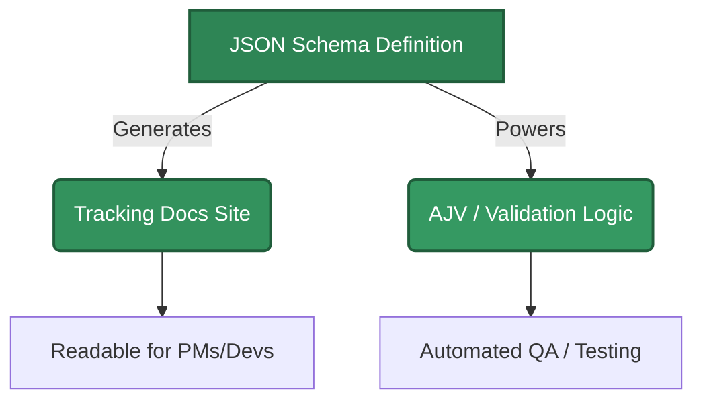

import Tabs from '@theme/Tabs';
import TabItem from '@theme/TabItem';
import Admonition from '@theme/Admonition';

# Welcome to Tracking Docs
Stop writing tracking plans in spreadsheets.

**Tracking Docs** is a Docusaurus plugin that treats your analytics documentation as code. It generates beautiful, versioned, and testable tracking documentation directly from **JSON Schema**.

---

## 📉 The Problem

When teams start a tracking setup, they often begin with a spreadsheet. It seems easy at first, but it quickly breaks down:

* **Drift:** Implementation diverges from the spreadsheet, and no one updates the doc.
* **Untestable:** You cannot validate your live `dataLayer` against a Google Sheet.
* **Unmaintainable:** Copy-pasting parameters (like `user_id`) across 50 events is error-prone.

## 🚀 The Solution: Docs as Code

By defining your events as **JSON Schemas**, you create a single source of truth that powers both your documentation and your validation logic.

For validation of GTM dataLayers, you can use the [`tracking_validator`](https://github.com/benedikt-buchert/tracking_validator) project.
